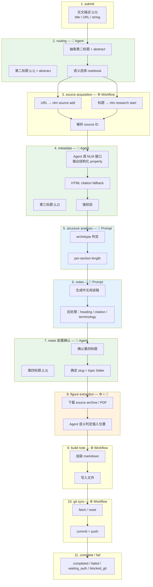

# Paper Queue 设计文档

最后更新：2026-04-18

## 1. 目标

这份文档要明确三件事：

1. `paper queue` 作为一个系统，哪些部分是确定性的流程。
2. 哪些部分是真正依赖 prompt 的语言任务。
3. 哪些部分是关键词 / 规则驱动，不能交给 `claude-glm` 或其他 Agent 自行发挥。

目标不是只解释“现在代码怎么跑”，而是把后续演进边界讲清楚：  
prompt 应该作为独立资产管理，workflow 负责生命周期编排，配置层负责 agent 接口与运行参数。

## 2. 单篇论文的生命周期

当前主入口在 [workflow.py](/workspace/paper_reading/paper_queue/workflow.py)。

### 2.0 标题层级术语

论文在生命周期中会被多次"命名"，每次都是对标题的一次精炼。统一术语如下：

| 层级 | 名称 | 产生阶段 | 含义 |
| --- | --- | --- | --- |
| L0 | **论文描述** (Paper Description) | `submit` | 用户原始输入：标题、arXiv 链接、PDF 链接或任意字符串 |
| L1 | **第二标题** (Second Title) | `routing` | Agent 首次从论文描述中抽取的论文标题，同时抽取 abstract |
| L2 | **第三标题** (Third Title) | `metadata` | Agent 基于 NotebookLM 源内容确认的正式论文标题 |
| L3 | **第四标题** (Fourth Title) | `notes 前置` | notes 生成前最终确认的标题，用于文件名和 frontmatter |

后续所有设计讨论和代码注释统一使用此术语。

### 2.2 生命周期流程图



图例：
- 🤖 Agent 驱动（绿色）— 需要 claude-glm 语义判定
- 📝 Prompt 驱动（蓝色）— 通过 prompt 模板的语言生成
- ⚙️ Workflow 驱动 — 确定性代码
- 🤖+⚙️ 混合（橙色）— workflow 提取 + agent 语义判定

### 2.1 生命周期阶段

一篇论文经历以下阶段：

1. `submit` — **论文描述 (L0)**
   - 用户提交论文标题、arXiv 链接、PDF 链接，或者其他字符串输入。
   - 可选地指定 NotebookLM notebook。
   - 系统先把任务写入 SQLite 队列。
   - **此阶段的输入统一称为"论文描述"，不预设其格式。**

2. `routing` — **→ 第二标题 (L1)**
   - Agent 从论文描述中抽取第二标题和 abstract。
   - 基于标题 + abstract 语义选择对应 notebook。
   - 如果用户手动指定 notebook，则跳过 agent 路由，但仍需抽取第二标题。
   - **当前实现**：关键词 overlap 匹配（`_route_tokens` / `_overlap_score`），待重构为 agent 语义路由。

3. `source acquisition`
   - URL 输入：
     - 调用 `nlm source add <notebook> --url ... --wait`
     - 如果 `arxiv.org/abs/...` 失败，则 fallback 到 PDF URL
   - 标题 / query 输入：
     - 调用 `nlm research start ... --auto-import`
   - 然后解析最终导入的 source ID

4. `metadata` — **→ 第三标题 (L2)**
   - Agent 调 NotebookLM 接口查询 metadata。
   - 输出结构化 property 格式（非自由文本）。
   - 确保完整获取 institution、authors、venue。
   - 确认第三标题。
   - 用多证据 fallback 做补全：HTML citation meta、arXiv API、LaTeX source、PDF frontmatter、OpenAlex，再做 evidence fusion 与强校验。
   - **当前实现**：通过 `nlm notebook query` 发送 metadata prompt，解析自由文本；待重构为 agent 结构化输出。

5. `structure analysis`
   - Agent 分析论文结构，判断 archetype 和各章节篇幅建议。
   - 输出 per-section length (short / medium / long) 和 figure priority。

6. `notes`
   - Agent 生成中文阅读稿 markdown。
   - 基于 structure analysis 结果调整各章节篇幅。
   - 做 heading normalization、inline citation cleanup 等后处理。

7. `notes 前置：标题与路由确认` — **→ 第四标题 (L3)**
   - Agent 提取第四标题做最终确认，确保标题无误。
   - 确定文件名短标题 slug。
   - 确定 canonical topic folder。
   - taxonomy 展示名与目录名分离：展示名保留为可读 topic，目录名统一转为连字符 slug。
   - **当前实现**：`_resolve_archive_topic` 关键词启发式 + `_resolve_output_target` 文件名生成；待重构为 agent 完成。

8. `figure extraction`
   - 优先下载 arXiv source archive，解析 `\includegraphics` 和 `\caption`。
   - Fallback 到 PDF embedded image extraction。
   - Agent 理解图片语义后决定插入位置。
   - **当前实现**：section keyword heuristic placement；待重构为 semantic placement。

9. `build note`
   - 组装最终 markdown：frontmatter + normalized notes + figure injection。
   - 写入文件。

10. `git sync`
    - 同步 Git repo（fetch / reset）。
    - commit + push。

11. `complete / fail`
    - 写结果、日志、输出路径。
    - 标记为 `completed / failed / waiting_auth / blocked_git`。

## 3. 确定性流程 vs Agent 驱动 vs Prompt 驱动

### 3.1 确定性流程（Workflow Layer）

这些应该留在 workflow / runtime / config 里，不应该交给 agent 或 prompt：

- 队列状态机：
  - `queued -> running -> completed/failed/waiting_auth/blocked_git`
- Source import 机制：
  - `nlm source add`
  - `nlm research start`
  - arXiv abs -> PDF fallback
- Metadata 强校验：
  - 哪些字段是必填
  - 缺失时直接失败
  - source fingerprint 一致性检查
- Git 操作：
  - fetch / reset / add / commit / push
- 前端交互状态：
  - `submitting`
  - `retry`
  - `delete`
  - latest-version 判定
- Notebook CRUD：
  - notebook list / notebook describe / notebook create
  - notebook 选择结果的应用

这些都属于系统流程，不应该让 Agent 自己决定。

### 3.2 Agent 驱动步骤（当前为 heuristic，待 Agent 化）

这些步骤需要语义理解，当前用关键词/规则启发式实现，应重构为由编排者 agent (claude-glm) 完成：

- **Routing**（stage 2）：从论文描述抽取第二标题 + abstract，语义选择 notebook
  - 当前：`_route_tokens` / `_overlap_score` 关键词 overlap
  - 目标：agent 语义路由
- **Metadata 提取**（stage 4）：调 NotebookLM 接口，输出结构化 property，确认第三标题
  - 当前：`nlm notebook query` + 自由文本解析
  - 目标：agent 结构化输出
- **Notes 前置确认**（stage 7）：第四标题确认、slug 生成、canonical topic folder 判定
  - 当前：`_resolve_archive_topic` 关键词 + `_resolve_output_target` 规则
  - 目标：agent 语义判定
- **Figure 语义插入**（stage 8）：理解图片含义后决定插入位置
  - 当前：section keyword heuristic
  - 目标：agent 语义 placement

### 3.3 Prompt 驱动步骤（Prompt Registry Layer）

这些是纯语言生成任务，通过 prompt 模板驱动：

- structure analysis prompt — 论文结构分析
- note generation prompt — 中文阅读稿生成
- readability review prompt — 可读性审读

Prompt 已拆到 `paper_queue/prompts/` 目录，通过 `PromptLoader` 加载。

## 4. 当前 Prompt 清单

### 4.1 Metadata Prompt

当前位置：
- [workflow.py](/workspace/paper_reading/paper_queue/workflow.py)
- 函数：`_query_metadata()`

当前职责：
- 提取：
  - full paper title
  - conference / journal / accepted venue
  - publication year
  - author list
  - author affiliations
  - original paper URL
  - GitHub repo URL

当前输出假设：
- 简洁结构化文本，每个字段一行

当前问题：
- prompt 文本直接嵌在 workflow 代码里
- prompt 迭代和 workflow 逻辑耦合
- fallback 逻辑一部分靠 prompt，一部分靠代码，边界不清楚

### 4.2 Note Prompt

当前位置：
- [workflow.py](/workspace/paper_reading/paper_queue/workflow.py)
- 函数：`_query_notes()`

当前职责：
- 生成中文阅读稿 markdown
- 顶层结构固定为：
  - `TL;DR`
  - `论文基本信息`
  - `1. 整体概括`
  - `2. 背景与动机`
  - `3. 方法与系统设计`
  - `4. 实验设置`
  - `5. 结果与分析`
  - `6. 总结与思考`

当前 prompt 控制的要求：
- 保留关键英文术语
- 不编造事实
- 去掉 inline citation markers
- 结果段必须写数字和对比
- 总结段必须写局限性 / 风险 / 开放问题
- 按 archetype 强化重点：
  - `systems`
  - `evaluation`
  - `safety`
  - `tuning`
  - `retrieval`
  - `general`

当前问题：
- 结构要求、风格要求、领域偏好都揉在一个长字符串里
- 后面如果继续加“章节长短动态分配”“作者观点 vs 个人启发分离”，这个 inline prompt 会越来越难维护

## 5. 关键词 / 规则驱动部分（当前状态与迁移方向）

### 5.1 Topic Taxonomy Routing

当前位置：`ROUTE_TOPIC_MAP`，在 [workflow.py](/workspace/paper_reading/paper_queue/workflow.py)

当前 canonical topics：
- `Kernels Engineering`
- `System Performance`
- `Agent Harness Evaluation`
- `Ops4LLM`
- `Automated Tuning`
- `LLM Memory, Context, and Retrieval`

当前行为：tokenize + overlap score + 选择最匹配 topic / notebook

**迁移方向**：路由判定将迁移到 agent 语义路由（Design 2）；但 canonical topic list 本身仍作为配置保留在 workflow layer。

### 5.2 Figure Section Classification

当前位置：`_classify_figure_section()`，在 [workflow.py](/workspace/paper_reading/paper_queue/workflow.py)

当前行为：根据 section text 和 caption 关键词把图分类到 background / method / experiment / results / conclusion

**迁移方向**：图片插入位置将迁移到 agent 语义判定（Design 5）；图片提取（下载、解析、导出）本身仍保留在 workflow layer。

### 5.3 Metadata Fallback And Validation

当前位置：`_fallback_metadata()` / `_validate_metadata()`

当前行为：fallback 到 HTML citation tags、拒绝占位值、缺字段就失败

**迁移方向**：fallback 和 validation 逻辑保持确定性；metadata 提取本身迁移到 agent（Design 3）。

### 5.4 Agent 交互模式

当前 agent 交互模式：**per-query fresh invocation**。

每次需要 agent 行为时，启动一个独立进程（`nlm notebook query` 或 `claude -p`），查询完毕进程退出。没有 session ID、没有会话延续、没有共享 context。阶段间状态完全靠 Python 变量传递。

**优缺点**：
- 优点：每次调用隔离、可重试、context window 可控
- 缺点：无跨阶段语义连贯性、重复加载上下文
- 未来是否改为持续会话需权衡 context window 成本 vs 语义连贯性

## 6. 目标边界设计

后续应该拆成四层：

### 6.1 Workflow Layer

继续保留在 `workflow.py` / `runtime.py` 中：

- job lifecycle orchestration
- queue state and logging
- source import
- metadata fallback / validation
- figure extraction（下载、解析、导出）
- git write / push

workflow 层编排 agent 调用和 prompt 注入，但不做语义判定。

### 6.2 Agent Layer（新增）

由编排者 agent (claude-glm) 完成的语义任务：

- routing：从论文描述抽取第二标题 + abstract，语义选择 notebook
- metadata 提取：调 NotebookLM 接口，输出结构化 property，确认第三标题
- notes 前置确认：第四标题确认、slug 生成、canonical topic folder 判定
- figure 语义插入：理解图片含义后决定插入位置

Agent layer 通过 `Runtime.run()` 或 `run_shell_streaming()` 调用，当前每次独立进程启动。

### 6.3 Prompt Registry Layer

```text
paper_queue/prompts/
  metadata_v1.txt
  structure_analysis_v1.txt
  notes_v1.txt
  readability_review_v1.txt
```

职责：

- 只存 prompt 文本
- 支持独立版本化
- 支持独立 review
- 让 prompt diff 和 workflow diff 分开

### 6.4 Configuration Layer

```text
paper_queue/config/
  defaults.json
```

职责：

- 指定当前使用的 agent backend（`claude-glm`）
- 指定当前使用的 prompt set / prompt version
- 指定超时、feature flags、retry policy 等参数

## 7. 推荐的 Prompt 拆分

### Prompt A: `metadata_v1`

职责：
- 只做 bibliographic metadata extraction

允许做的事：
- 读 source 内容
- 返回结构化 metadata 字段

不允许做的事：
- 决定 taxonomy topic
- 决定 notebook 路由
- 决定文件命名
- 决定 retry 行为

### Prompt B: `structure_analysis_v1`

职责：
- 在生成正文前，先判断论文结构重点

建议输出：
- paper archetype
- 各章节长度建议：
  - background: short / medium / long
  - method: short / medium / long
  - experiments: short / medium / long
  - results: short / medium / long
  - conclusion: short / medium / long
- figure priorities

这一步是后续实现“章节长度动态分配”的关键。

### Prompt C: `notes_v1`

职责：
- 基于 metadata + structure analysis + source content 生成正文

不应该负责：
- notebook 路由
- taxonomy topic
- 文件命名
- git 行为

### Prompt D: `readability_review_v1`

职责：
- 审读渲染后的 markdown / PDF 可读性

目标：
- 检查是否连续堆图
- 检查图文是否交错
- 检查章节是否失衡

它应该只输出 review 结果，不直接改 workflow。

## 8. 推荐保留为规则配置的项目

这些内容不应该写进 prompt，而应该保留为显式配置或代码：

- canonical taxonomy list
- notebook overlap scoring threshold
- source import fallback order
- metadata required fields
- filename pattern
  - `<year>-<venue>-<short-title>[-vN].md`
- latest-version detection
- assets directory pattern
  - `paper/<topic-slug>/<year>-<venue>-<short-title>[-vN].md`
  - `paper/_assets/<topic-slug>/<note-stem>/...`
- retry policy
  - failed retry
  - non-latest completed retry
- framework version bump policy
- agent backend choice
- prompt version selection

## 9. 重构顺序

### 已完成（0.1.x）

1. ~~新增 `paper_queue/prompts/`~~
2. ~~把 metadata prompt 拆到 `metadata_v1.txt`~~
3. ~~把 notes prompt 拆到 `notes_v1.txt`~~
4. ~~新增 prompt loader~~
5. ~~用 prompt loader 替换 `workflow.py` 里的 inline string~~
6. ~~新增 `structure_analysis_v1.txt` 并接入 note generation 前~~
7. ~~新增 `readability_review_v1.txt`~~
8. ~~新增 configuration file (`paper_queue/config/defaults.json`)~~
9. ~~把 `claude-glm` / agent command / prompt version / timeouts 都迁到配置层~~

### 待实施（0.2.0）

按依赖顺序：

1. **Design 1**: 统一标题层级术语（本文档 2.0 节）✓
2. **Design 2**: Routing 阶段 Agent 化
   - 新增 routing prompt 或 inline agent instruction
   - agent 从论文描述抽取第二标题 + abstract
   - 基于语义选择 notebook
3. **Design 3**: Metadata 阶段 Agent 化
   - agent 调 NotebookLM，输出结构化 property
   - 确认第三标题
4. **Design 4**: Notes 前置 Agent 化
   - agent 确认第四标题、slug、canonical topic folder
5. **Design 5**: Figure semantic extraction
   - agent 理解图片语义后决定插入位置
6. **Design 6**: (低优先级) Figure stitching optimization
7. **Design 8**: Future non-arXiv support

### 未来扩展

- 支持非 arXiv 论文（Design 8）
- 持续会话模式 vs per-query fresh invocation 的权衡
- 前端详情页展示 readability review 结果

## 10. 总结

当前真实情况是：

- queue lifecycle 大部分是确定性 workflow
- notebook routing 和 taxonomy routing 当前是关键词 / 规则驱动，待迁移到 agent
- figure extraction 当前是确定性 + heuristic，placement 待迁移到 agent
- metadata 提取当前通过 NotebookLM prompt，待迁移到 agent 结构化输出
- 标题在生命周期中被逐步精炼：论文描述 (L0) → 第二标题 (L1) → 第三标题 (L2) → 第四标题 (L3)

这份文档定义的目标架构是四层分离：

1. **Workflow Layer** — 确定性流程编排
2. **Agent Layer** — 语义判定（routing、metadata、notes 前置、figure placement）
3. **Prompt Registry Layer** — 独立 prompt 资产
4. **Configuration Layer** — agent backend 与运行参数
